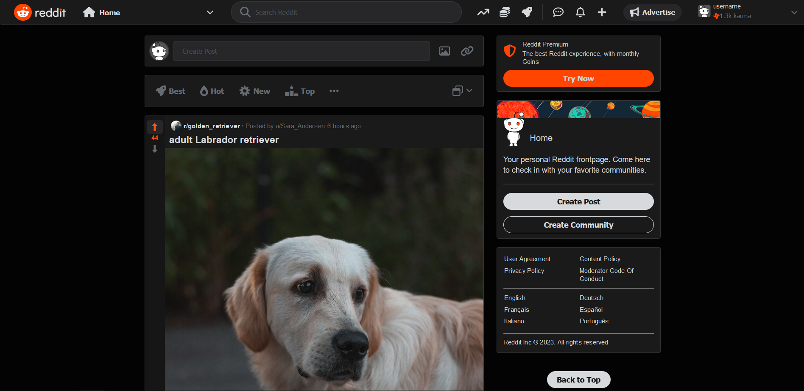

# Reddit Clone in React

This practice project aims to recreate the home page of Reddit as of march 2023 in react. 

Check out my [other repository](https://github.com/teooko/Reddit-Clone-Vanilla) of the same page made in **pure html, css and javascript**. 



# Technical Details

The page uses a social media mock api called [dummyapi.io](https://dummyapi.io/) and [Lorem Picsum](https://picsum.photos/) for subbreddit pictures. There are 5 posts added to the feed each time the user scrolls to the bottom of the page. Each post request is used to set the subreddit name and picture, username and number of upvotes. There is an additional request for the total number of comments.

# Setting up

The api key needs to be placed in a file named **config.js** inside the **src** folder, with the content:
```
const envConfig = {
    API_KEY: {your key}
};

export default envConfig
```

